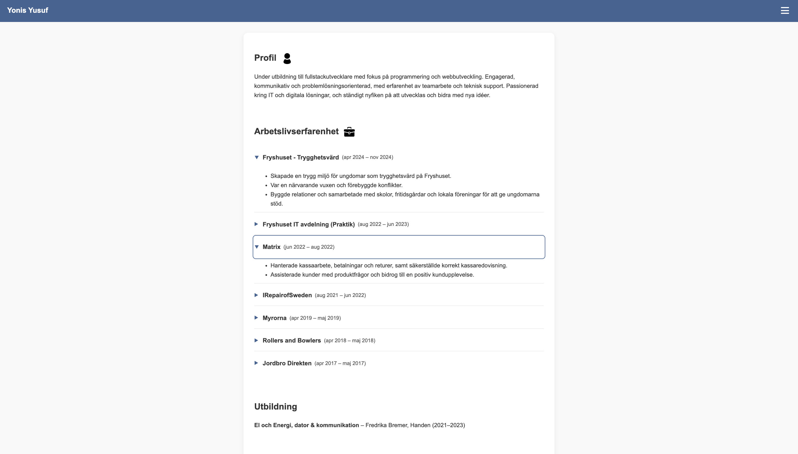
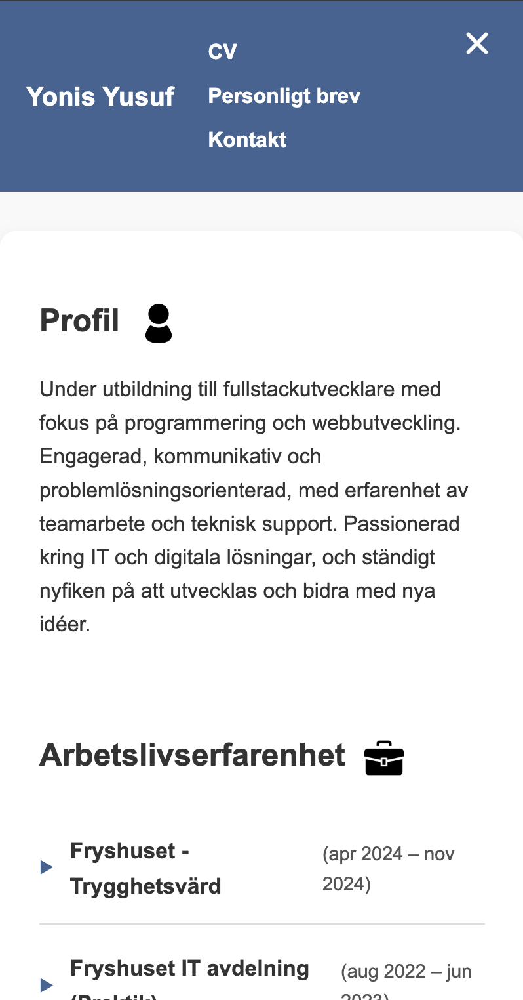

# CV Webbplats - Yonis Yusuf

## 💡 Inspiration & Bakgrund

Detta projekt började med mitt fysiska CV i PDF-format som jag använt för jobbansökningar. Jag insåg att ett digitalt CV skulle vara mycket mer lättillgängligt - något jag enkelt kan dela via en länk istället för att skicka filer. Det kändes också som en perfekt möjlighet att visa mina tekniska färdigheter direkt genom själva CV:t.


Idén var enkel: Ta mitt befintliga CV och omvandla det till en responsiv, modern webbplats som fungerar lika bra på mobilen som på datorn. Samtidigt ville jag bygga något jag kan fortsätta utveckla - en grund för en framtida portfolio.

## 🚀 Framtidsplaner

Den här webbplatsen är bara början. Mina planer inkluderar:

- **Portfolio-sektion**: Visa mina kodprojekt med demos och källkod
- **Projekt-loggar**: Dokumentera min utveckling och vad jag lär mig
- **Interaktiva demos**: Experimentera med nya tekniker och visa upp dem
- **Blogg**: Skriva om utmaningar jag löst och saker jag lärt mig

När jag känner mig utbränd eller extra motiverad kan jag komma tillbaka hit och fortsätta bygga. Det är mitt digitala "lekrum" för webbutveckling.

## 🎯 Projektbeskrivning

En responsiv CV-webbplats byggd med semantisk HTML5 och modern CSS3, helt utan JavaScript. Webbplatsen består av tre sidor:

- **CV-sida** (index.html) - Min arbetserfarenhet med accordion-komponenter, utbildning och språkkunskaper
- **Personligt brev** (letter.html) - Presentation av mig själv och mina mål
- **Kontakt** (kontakt.html) - Mina kontaktuppgifter

## 📸 Skärmdumpar

### Desktop-vy

*CV-sidan på desktop med alla arbetsplatser i accordion-format*

### Mobil-vy med Hamburgermeny

*Responsiv hamburgermeny som öppnas med checkbox-hack*

## 🧗 Utmaningar & Lösningar

### Utmaning 1: Hamburgermeny utan JavaScript
**Problem**: Hur skapar man en fungerande meny som kan öppnas/stängas utan JavaScript?

**Lösning**: Jag använde "checkbox-hack" - en dold checkbox som styr menyn via `:checked`-selectorn. När checkboxen är ikryssad visas menyn, annars är den gömd.

```css
.nav-toggle:checked ~ .main-nav {
  display: block;
}
```

**Svårighet**: Att få hamburger-ikonen att animera till ett "X" krävde rätt positioning av pseudo-element (::before och ::after). Mycket trial-and-error med transform och rotation!

### Utmaning 2: Accordion för arbetslivserfarenhet
**Problem**: Mitt PDF-CV hade alla jobb listade, men det blev för långt och rörigt på webbsidan.

**Lösning**: Använde HTML5 `<details>` och `<summary>` element för att skapa klickbara accordion-sektioner. Varje jobb kan expanderas/kollapsa.

```html
<details class="job-accordion">
  <summary>Jobbtitel <span class="job-date">(datum)</span></summary>
  <ul class="job-details-list">...</ul>
</details>
```

**Svårighet**: CSS-styling av `<details>` är knepig eftersom webbläsare har olika default-styles. Jag fick ta bort default-pilen och skapa min egen med ::before pseudo-element som roterar när sektionen öppnas.

### Utmaning 3: Responsiva bilder
**Problem**: Ikoner skulle se skarpa ut både på mobil och desktop, samt laddas i rätt storlek.

**Lösning**: Skapade tre versioner av varje ikon (small, medium, large) i WebP-format och använde `srcset` och `sizes`:

```html

```

**Svårighet**: Att förstå hur `sizes`-attributet fungerar tog tid. Jag trodde först det var bildstorlekar, men det är faktiskt hur mycket plats bilden tar i layouten.

### Utmaning 4: Tillgänglighet
**Problem**: Hamburgermeny och accordion måste fungera för tangentbordsanvändare och skärmläsare.

**Lösning**: 
- Lade till `aria-label` på checkbox och label
- Använde `aria-current="page"` för aktiv sida
- Skapade tydlig `:focus-visible` styling
- Implementerade `prefers-reduced-motion` för användare som inte vill ha animationer

**Svårighet**: Att testa med tangentbord och förstå vad som faktiskt syns för skärmläsare

## ✨ Designbeslut

### Färgval
- **Primärfärg**: `#406593` (Professionellt blått)
  - Vald för att signalera trovärdighet och professionalism
  - Används i header, hover-effekter och accenter
- **Bakgrundsfärger**: 
  - `#f9f9f9` (ljusgrå body)
  - `#ffffff` (vit för main-content)
  - `#eeeeee` (footer)
- **Textfärger**: 
  - `#333` (huvudtext - mörkgrå för god läsbarhet)
  - `#555` (sekundär text för datum)
  - `#fff` (vit text i header)

**Motivering**: Färgschemat är avsiktligt återhållsamt för att hålla fokus på innehållet och ge ett professionellt intryck. Kontrasten mellan text och bakgrund uppfyller WCAG AA-krav (4.5:1 för brödtext).

### Typografi
- **Font**: Arial, sans-serif
  - Vald för maximal läsbarhet på alla enheter
  - Systemfont = snabb laddning, inga externa requests
- **Storleksskala**:
  - Body: 16px (browser default)
  - H1: 1.25rem (20px) - kompakt för mobil
  - H2: Standard storlek
  - Små texter: 0.9-0.95rem för datum
- **Line-height**: 1.6 för god läsbarhet

**Motivering**: Enkel, tydlig typografi som prioriterar läsbarhet framför dekorativitet. Passar perfekt för ett CV där innehållet är viktigast.

### Layout
- **Desktop-först strategi**:Jag påbörjade projektet desktop-först. Då webbplatsens layout var relativt enkel, kunde jag dock smidigt upprätthålla god responsivitet för både mobil och desktop utan större problem."
- **Max-width på main**: 800px för optimal läslängd
- **Spacing**: Konsekvent padding och margin
- **Border-radius**: 12px på main för modern look
- **Box-shadow**: Subtil skugga (0 4px 12px rgba(0,0,0,0.08))

**Motivering**: Layouten är enkel och ren för att inte konkurrera med innehållet. Den centrerade main-containern med mjuka skuggor ger en modern känsla utan att vara överdrivet "designad". Detta är ett CV, inte en konstnärsportfolio.

## 🛠️ CSS-mönster för Interaktivitet (utan JavaScript)

### 1. Hamburgermeny (Checkbox-hack)
```css
.nav-toggle:checked ~ .main-nav {
  display: block;
}
```
- **Hur det fungerar**: En dold checkbox togglar menyn via `:checked`-selector
- **Animation**: Hamburger-ikonen (3 horisontella linjer) animeras till ett "X" när menyn öppnas
- **Tillgänglighet**: 
  - Checkbox är tangentbordsnavigerbar (Tab, Space)
  - ARIA-labels för skärmläsare
  - Focus-visible styling med outline

### 2. Accordion för Arbetslivserfarenhet (Details/Summary)
```html
<details class="job-accordion">
  <summary>Jobbtitel <span class="job-date">(datum)</span></summary>
  <ul class="job-details-list">...</ul>
</details>
```
- **Hur det fungerar**: HTML5 `<details>` element med CSS-styling
- **Animation**: Pil roteras 90° när sektionen öppnas
- **Tillgänglighet**:
  - Inbyggd tangentbordsstöd (Enter, Space)
  - Focus-visible ring på 2px med offset
  - Semantiskt korrekt för skärmläsare

## ♿ Tillgänglighetslösningar

### WCAG-krav uppfyllda:
1. **Skip-link**: Hoppa direkt till huvudinnehåll för tangentbordsanvändare
   ```html
   <a class="skip-link" href="#content">Hoppa till huvudinnehåll</a>
   ```

2. **Semantiska landmärken**: `<header>`, `<nav>`, `<main>`, `<section>`, `<footer>`

3. **ARIA-attribut**:
   - `aria-label` på hamburger-checkbox och label
   - `aria-current="page"` på aktiv navigationslänk
   - `role="presentation"` på dekorativa ikoner
   - `aria-hidden="true"` på hamburger-span

4. **Fokushantering**:
   ```css
   .job-accordion summary:focus-visible {
     outline: 2px solid #406593;
     outline-offset: 3px;
   }
   ```

5. **Reduced Motion**:
   ```css
   @media (prefers-reduced-motion: reduce) {
     *, *::before, *::after {
       animation: none !important;
       transition: none !important;
     }
   }
   ```

6. **Färgkontrast**: Alla text/bakgrund-kombinationer uppfyller WCAG AA (4.5:1)

7. **Responsiva bilder**:
   ```html
   
   ```

### Testning:
- ✅ Tangentbordsnavigation (Tab, Enter, Space)
- ✅ Skärmläsare (NVDA skärmläsare på Windows)
- ✅ Zoom till 200% utan horisontell scroll
- ✅ Reduced motion respekteras

## 📱 Responsivitet

### Brytpunkter:
- **Alla skärmstorlekar** - Hamburgermeny visas på både mobil och desktop
- **Responsivitet** - `main` anpassar sig automatiskt med max-width: 800px
- **Media query** - Endast för `prefers-reduced-motion` (tillgänglighet)

### Responsive bilder:
- Använder `srcset` och `sizes` för optimal bildladdning
- WebP-format för bättre komprimering (ca 30% mindre än PNG)
- Tre storlekar: small (50px), medium (100px), large (200px)
- `loading="lazy"` för bilder som inte syns direkt

## 📁 Filstruktur

```
📦 cv-projekt/
├── 📄 index.html          # CV-sida (huvudsida)
├── 📄 letter.html         # Personligt brev
├── 📄 kontakt.html        # Kontaktsida
├── 📄 style.css           # All styling (ca 250 rader)
├── 📁 assets/             # Bilder och ikoner
│   ├── person-small.webp  # Profil-ikon 50px
│   ├── person-medium.webp # Profil-ikon 100px
│   ├── person-large.webp  # Profil-ikon 200px
│   ├── bag-small.webp     # Portfolio-ikon 50px
│   ├── bag-medium.webp    # Portfolio-ikon 100px
│   └── bag-large.webp     # Portfolio-ikon 200px
└── 📄 README.md           # Denna fil
```

## 🚀 Publicering

Webbplatsen är publicerad på GitHub Pages:
👉 **https://wag1angel.github.io/cv-projekt/**

### Så här publicerade jag:
1. Skapade GitHub-repo `cv-projekt`
2. Pushade all kod till main-branchen
3. Aktiverade GitHub Pages i Settings → Pages → Source: main branch
4. Efter några minuter var sidan live!

## 🐛 Kända Begränsningar

1. **Ingen horisontell desktop-meny** - Hamburgermenyn visas även på stora skärmar (desktop). Det fungerar helt okej, men en traditionell horisontell meny hade sett mer professionellt ut på större skärmar. Jag skulle behöva lägga till en media query som döljer hamburger-ikonen och visar menyn horisontellt när skärmen är över t.ex. 768px.

2. **CSS Grid används bara på main** - Jag använder Grid endast på main-containern för att skapa spacing mellan sektioner. Jag hade kunnat använda Grid på fler ställen, som t.ex. footer-layouten eller för att strukturera accordion-innehållet mer avancerat.

3. **Få CSS-variabler** - Jag har bara två variabler (färg och spacing). Jag kunde ha lagt till fler för t.ex. font-storlekar, border-radius, och skuggor. Det hade gjort koden ännu lättare att underhålla om jag vill ändra designen senare.

4. **Accordion öppnas inte från URL** - Man kan inte länka direkt till ett specifikt jobb med anchor-länk eftersom `<details>` inte stöder detta utan JavaScript. Det hade varit praktiskt om någon vill dela en länk till ett specifikt jobb.

## 💡 Framtida Förbättringar

### Kort sikt:
- [ ] Desktop-meny istället för hamburgare på stora skärmar
- [ ] Lägg till smooth scroll
- [ ] Förbättra accordion-animation
- [ ] Dark mode med `prefers-color-scheme`
- [ ] Validera HTML/CSS med W3C validator

### Lång sikt:
- [ ] Expandera till portfolio med projekt-sektion
- [ ] Lägg till filter/sök-funktion för projekt
- [ ] Skapa kontaktformulär med HTML5-validering
- [ ] Blogg-sektion för utvecklingsloggar
- [ ] Översättning till engelska
- [ ] CV som PDF-download (ironiskt nog!)

## 📚 Lärdomar & Reflektioner

### Vad jag lärt mig:
- **CSS är kraftfullare än jag trodde** - Hamburgermeny och accordion utan JavaScript kändes omöjligt först
- **Tillgänglighet är inte svårt** - Det handlar mest om att tänka på det från början
- **Semantisk HTML hjälper alla** - Inte bara skärmläsare, även SEO och utvecklare som läser koden
- **srcset är grymt** - Rätt bildstorlek laddas automatiskt baserat på skärmstorlek
- **prefers-reduced-motion är viktigt** - Vissa användare mår fysiskt illa av animationer

### Vad som överraskade mig:
- **Att få hamburger-ikonen att animera till "X"** - Det tog mig flera försök att förstå hur `transform` och `rotate` fungerar tillsammans. Jag hade fel värden först och ikonen roterade åt fel håll!
- **Hur exakt `old_str` måste vara i CSS** - När jag skulle ersätta kod upptäckte jag att även ett extra mellanslag gör att det inte fungerar. CSS är mycket känsligt för whitespace på vissa ställen.
- **Hur mycket skillnad en subtil box-shadow gör** - Utan skugga såg main-boxen platt ut. Med en mjuk skugga blev det direkt mer professionellt och "lyft" från sidan.

### Vad jag skulle göra annorlunda:
- Planera CSS-strukturen bättre från start (BEM-naming)
- Använda CSS-variabler från början
- Göra fler mobil-tester tidigare
- Dokumentera medan jag kodar istället för i efterhand

## 🔧 Teknisk Stack

- **HTML5** - Semantisk markup
- **CSS3** - Modern styling utan ramverk
- **WebP** - Bildformat för optimal prestanda
- **Git/GitHub** - Versionshantering
- **GitHub Pages** - Gratis hosting

**Inga dependencies, inga build-steg, ingen JavaScript!**

## 📞 Kontakt

**Yonis Yusuf**  
📧 yonis.yusuf1@outlook.com  
📱 072-256 0919  
💼 [GitHub](https://github.com/wag1angel)

---

*Skapat som examinationsprojekt i HTML & CSS - Fullstack-utveckling 2025*
